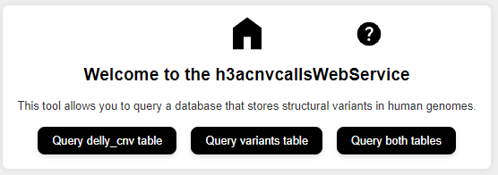
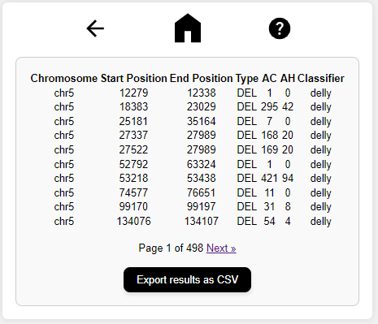

# h3acnvcallsWebService

The h3acnvcallsWebService queries a database that stores structural variants in human genomes. The database has data about the variant's location (chromosome number, start and end), type of variant and number of times the variant was found in the data set. To get information regarding the data used by this web service [click here](https://github.com/shaze/h3acnvcalls/tree/main/data).

This web service was created to allow for simple querying of the results obtained from the structural variant analyses.

The application uses Flask, sqlite3 and Jinja2.

## Installation

### Prerequisites

Ensure you have the following installed on your system:

- Python 3.x
- `pip` (Python package installer)
- `virtualenv` (optional, but recommended for creating a virtual environment)

### Step-by-Step Installation

1. **Clone the Repository**

2. **Create a Virtual Environment**

    python3 -m venv venv

3. **Activate the Virtual Environment**

    For macOS and Linux:
        source venv/bin/activate

    For Windows:
        venv\Scripts\activate

4. **Install Dependencies**

    ip install -r requirements.txt

5. **Set Environment Variables**

    For macOS and Linux:
        export FLASK_APP=app.py
        export FLASK_ENV=development

    For Windows:
        set FLASK_APP=app.py
        set FLASK_ENV=development

6. **Run the application**

    flask run

# Usage
The web service is easy to use. The first page a user sees after accessing the application is shown below.

A user can query either the delly_cnv table, variants table or both. In this example, a user queries the variants table.

The image shows the form used when specifying query parameters. The user selected chromosome chr5 and left the default start and end positions (the default values were determined by checking the minimum and maximum column values). The user selected the DEL as the variant type and the classifier as delly.

The image below shows the results.

The user can go through the different result pages and can also download all the results as CSV file.

# Limitations

Querying both tables can take a long time due to the large amount of data that might potentially have to be processed.

